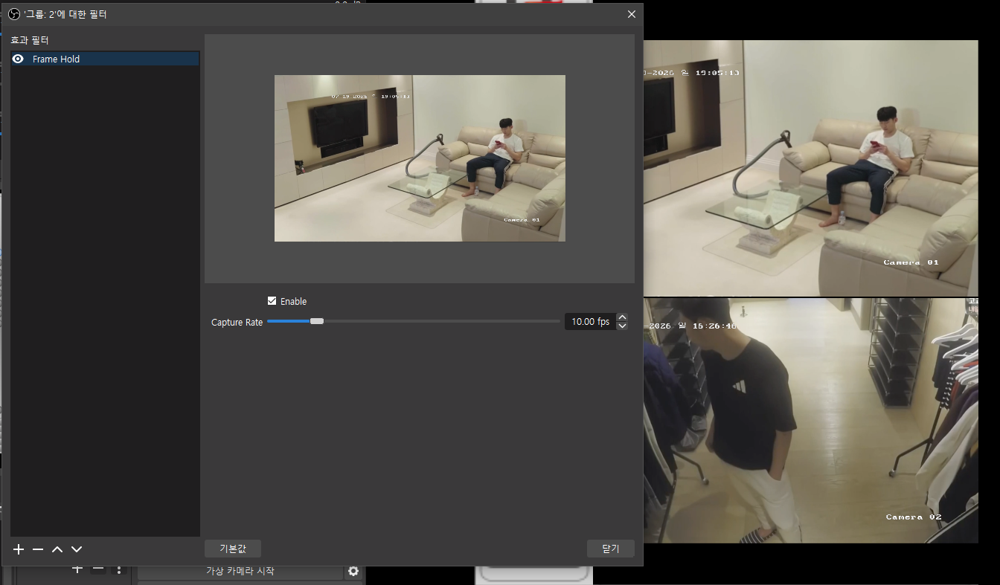
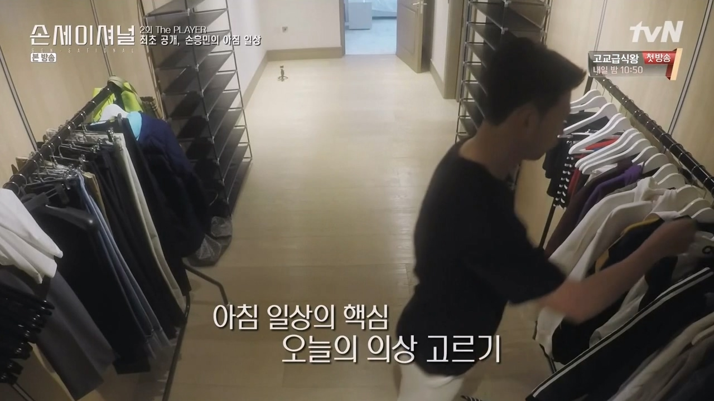

[English](README.md) | [한국어](README.ko.md)
# 🎬 Frame Rate Reducer for OBS

A simple OBS Studio filter plugin that creates a low-frame-rate effect by reducing the output frame frequency.

## ✨ Features

- 🎞️ Create a low FPS / stutter-style visual effect
- 🔧 Adjustable frame interval for custom frame rates
- 🎥 Works as an OBS Studio filter
- ⚡ Lightweight and optimized for real-time streaming

## 📸 Preview

### Preview Source from

## 🚀 Installation

1. Download the latest release
2. Extract the files into your OBS Studio installation folder
3. Restart OBS Studio
4. Add "Frame Rate Reducer" to your source filters

## 💡 Use Cases

- Retro game / old camera effects
- Low FPS video style
- Stream transitions
- Creative visual effects
- Stylized camera effects

## 🛠️ Development

Built with:
- C++
- OBS Studio Plugin API
- CMake

## ☕ Support

If you find this plugin useful, consider supporting the project:

## 📄 License

MIT License
